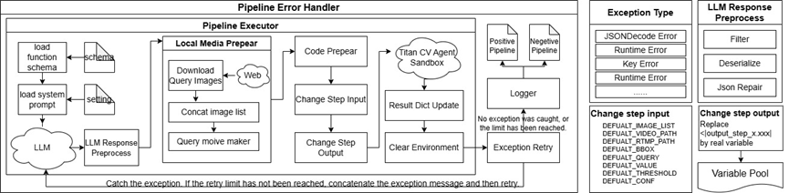

# Titan CV Agent Executor

**Titan CV Agent Executor is a computer vision task executor based on sandboxed environment.** It uses multi-step CV solutions generated by the Planner to sequentially execute a series of computer vision requests, thereby completing more complex computer tasks.

It is designed to handle advanced, time-sensitive CV tasks that require sequential execution, which are usually not solved by a single step (such as VLM), but require multi-step serial collaboration to be finally completed.

Example of a simple CV task:

> "Can you identify whether this image shows a cat or a dog?"

>
>"I need an agent to tell me how many apples are on the plate?"

Example of a complex CV task:

> "Help me monitor how many parts fall into the blue box below within 2 to 5 seconds?"

>
>"I need a visual assistant to issue a warning when the water level does not meet the conditions and summarize all the warnings in a day into a report."

Titan CV Agent Executor is prepared for such complex tasks.


During the execution process, the Executor will parse the incoming instructions to execute or generate a workflow, and a workflow is composed of multiple skills. The execution plan generated by the LLM/VLM Planner is formatted as a string. How to put this plan into practice and execute each step in the Titan CV Sandbox and obtaining the results are the main concerns of this chapter. We require an executor capable of automatically executing each step in sequence according to the serial steps based only on the LLM execution plan, with related pictures and videos (simulating user input). At the functional level, all skills that may be called are divided into two categories: basic skills (for example, Base Functions are basic skills and cannot be split), and adaptive skills such as Adapter Functions. Basic skills cover core functions such as object detection, image segmentation, image classification, OCR, VLM, tracking, counting, and visualization, providing reliable skills(capabilities) for most computer vision tasks. Adaptive skills are used to handle result merging, data conversion, and functions that basic skills do not have, and will generate code on site according to requirements. If the call is successful, the system will store the returned results (such as detected location information, recognized text, etc.) locally, or upload them to the cloud as needed for subsequent collaboration. If the execution fails or an exception occurs, the fault log is written through the logger to provide a basis for subsequent debugging. Through the above architectural design, researchers or developers can flexibly call various basic and adaptive skills to perform detection, segmentation, OCR, and VLM tasks, providing higher efficiency and maintainability for large-scale computer vision experiments and actual deployment scenarios.


## Architecture and Process

### Overall Architecture



Overall, the executor can be consists of three main stages: LLM loading and response preprocessing, Sandbox execution preparation and actual execution, and the corresponding error handling mechanism. Each stage has several functional modules that are combined and coordinated with each other.

#### **LLM loading and response preprocessing**

**Load Function Schema**: When the user CV request is run for the first time, the constraints (Schema) of all skills (Base Function) are loaded from the local file, which serves as the basic skill library.

**Load system prompt**: Also for the first run (not in the retry loop), the System prompt in the configuration file will be loaded and pasted in front of the user request.

**LLM**: LLM is pre-configured in the form of a service. The information input to LLM includes Function schema + System prompt + User query + Error Message (not the first round) + Inference Parameter

LLM - Error Message: Returns the previous erroneous workflow and related error messages. in the form of multiple rounds of dialogue.

LLM - Inference Parameter: {"model": "Qwen2.5-72B-Instruct","temperature": 0,"stream": False}

**LLM Response Preprocess**:

The sub-steps of preprocessing the output of LLM are:

LLM Response Preprocess - Filtering: Conduct preliminary filtering on the output, such as avoiding natural language descriptions mixed before and after json.

LLM Response Preprocess - Deserialize: Try to deserialize the string output by LLM into a usable data format. Resolve Step Input / Output.

LLM Response Preprocess - Json Repair: When JSON is incomplete or has a few syntax errors, you can try to repair it.

From then on, we got a relatively clean workflow plan that can be used directly as a Workflow.

#### Execution Preparation

After getting the execution plan, we will prepare the media and code that may be used in the execution according to the environment.

**Download Query Images**: According to the workflow, summarize all the steps containing the keyword "query_list" to process the request, and start downloading these images from the network according to the keyword in the entire workflow.

**Concatenate image list**: Merge and remove duplicates of the downloaded images to form a unified image list (image list) as the part of simulating user image input.

**Query movie maker**: Splice the images in the image list into a video, and its fps can be adjusted in advance. To adapt to the situation where some queries require video output.

**Code Prepear**: Regarding the "adapter_function" part, execution preparation will be made in advance before the workflow is executed.

**Change Step Input**: If the input required by the current step is an image list, the workflow will replace it with a real local executable media path, and its path comes from the image or video downloaded or synthesized in the previous step. If it is not a media input, it will be preliminarily judged based on the parameter name and some default values will be entered (such as BBOX area, THRESHOLD threshold, etc.). If the input cannot be judged (starting with <|input_step... in the workflow), it will be replaced with a default placeholder will be used instead.

**Change Step Output**: If the current step contains placeholders such as , this step is replaced with the actual variable or file path. The results of the previous execution have been stored in the variable pool. This step will search for the correct variable in the variable pool.

#### Sandbox execution

**Titan CV Sandbox**: A sandbox environment for performing CV-related operations. Please refer to the previous introduction.

**Result Dict Update**: After executing the corresponding Step, write the execution result to the result dictionary (variable pool) for use in subsequent steps.

**Clear Environment**: After the execution is completed, clean up the execution environment to avoid residual data affecting subsequent operations.

#### Error handling mechanism

##### Exception Handling and Retry

This means that if an exception occurs in any step (including LLM exception, inability to reverse LLM output, parameter passing failure, sandbox execution exception, file operation exception), it will be captured.

If the number of attempts remains within the predefined retry limit, the exception information will be attached to the dialogue, and the entire workflow will be retried to try Planner's self-correction. If the number of retries is exceeded, the final stage will be entered.

If any retry succeeds, the result will be recorded in the “Positive Workflow”. If the maximum number of retries is reached and it is still not successful, it will be written to the "Negative Workflow".

The recorded information includes: "id": workflow sequence number, "input": user requirements, "output": workflow, "trajectory": variable pool data during operation, "history": error information, "source": user requirement source, "model": LLM name used. Any exception or key information in the workflow must be written to the log, including success or failure status, error description, retry status, etc.

In summary, the executor uses LLM to generate a complete workflow management process of workflow plan, combined plan deserialization, keyword media preparation, adaptive skill code preparation, CV sandbox actual execution and abnormal retry. Through the series connection and cooperation of each module, the closed-loop control of receiving, processing, retrying and final output results of user requests is realized.


## Getting Started

### Local installation

#### Installation instructions

```bash
# Create a conda environment. Ensure Conda or Miniconda is installed beforehand.
conda create -p {YOUR_SANDBOX_ENVIRONMENT_PATH} python==3.10.0 -y
# Activate the created EXECUTOR environment
conda activate {YOUR_EXECUTOR_ENVIRONMENT_PATH}
# Go to the EXECUTOR working directory
cd {YOUR_EXECUTOR_PATH}
# Install necessary dependencies. If the installation is slow, consider using '-i https://pypi.tuna.tsinghua.edu.cn/simple' to switch to a faster mirror source.
pip install requests==2.32.3
pip install beautifulsoup4==4.12.3
pip install ultralytics==8.2.87
pip install "flask[async]"
# Environment parameter settings. All environment variables are valid only for the current terminal session. Please consider writing them to ~/.bashrc for permanent effect.
# EXECUTOR working directory
EXECUTOR_ROOT={YOUR_EXECUTOR_PATH}
# Reserved field of LLM Planner. For example, when training the planner, the output address is fixed, such as /output or os.getenv to obtain the environment variable. The actual address can be written here for replacement.
RESERVED_PATH={YOUR_EXECUTOR_PATH}/workspace/baohan/code/agent_series/agent_new/output/
# If the call of LLM/VLM Planner requires authentication, please enter the key. If no authentication is required, do not set it.
ACCESS_KEY=sk-******
# Planner address, generate LLM/VLM of CV solution
PLANNER_LLM_URL=https://api.siliconflow.cn/v1/chat/completions
# The actual address of calling Sandbox
CALL_FUNCTION_URL=http://titan-cv-agent-opensource-sandbox-service.develop:52001/call_function
# The output address of EXECUTOR (such as processed images and videos)
EXECUTOR_OUTPUT_DIR=/models/baohan/opensource/output/
# Default image replacement list
DEFAULT_IMAGE_LIST=["/datacanvas/data/images/road.jpg"]
# Default video replacement list
DEFAULT_VIDEO_PATH=/datacanvas/data/videos/cv_demo_short.mp4
# Default video stream replacement list
DEFAULT_RTMP_PATH=/datacanvas/data/videos/cv_demo_short.mp4
# Startup Flask
python executor/cv_agent_quick_executer_api.py
```


#### Installation Examples

```bash
pip install Flask==3.0.3 -i https://pypi.tuna.tsinghua.edu.cn/simple
pip install requests==2.32.3 -i https://pypi.tuna.tsinghua.edu.cn/simple
pip install beautifulsoup4==4.12.3 -i https://pypi.tuna.tsinghua.edu.cn/simple
pip install ultralytics==8.2.87 -i https://pypi.tuna.tsinghua.edu.cn/simple
pip install "flask[async]"
EXECUTOR_ROOT=/datacanvas/titan_cv_agent_executor
RESERVED_PATH=/datacanvas/output/
ACCESS_KEY=sk-******
PLANNER_LLM_URL=https://api.siliconflow.cn/v1/chat/completions
CALL_FUNCTION_URL=http://sandbox-service:12345/call_function
EXECUTOR_OUTPUT_DIR=/datacanvas/output/
DEFAULT_IMAGE_LIST=["/datacanvas/data/images/road.jpg"]
DEFAULT_VIDEO_PATH=/datacanvas/data/videos/cv_demo_short.mp4
DEFAULT_RTMP_PATH=/datacanvas/data/videos/cv_demo_short.mp4
python executor/cv_agent_quick_executer_api.py
```


#### Working directory structure

```
titan_cv_agent_executor/ #Working directory, which can be the specified location of EXECUTOR_ROOT.
├── executor/ #Executor core file
│ ├── cv_agent_quick_executer.py #Executor logic
│ └── cv_agent_quick_executer_api.py #Executor exposed API
├── runtime/ #Runtime file
│ ├── logs #Save runtime logs
│ └── running_result #Save the result after running
├── ap_config.py #Executor configuration file
├── ap_error_message.py #Executor error message
├── exist_func_def.json #Function schema definition
```


#### Executer Parameters

```bash
# Root directory of the executor
EXECUTOR_ROOT = "/workspace/baohan/code/agent_series/opensource/titan_cv_agent_executor"
# If the call of LLM/VLM Planner requires authentication, ACCESS_KEY is required
ACCESS_KEY = ""
# The name of the call model of LLM/VLM Planner.
PLANNER_LLM_MODEL_NAME = "Qwen/Qwen2.5-72B-Instruct"
# The call model address of LLM/VLM Planner.
PLANNER_LLM_URL = "https://api.siliconflow.cn/v1/chat/completions"
# Address to call Sandbox
CALL_FUNCTION_URL = "http://127.0.0.1:52001/call_function"
# Maximum timeout in seconds
TIMEOUT_SECONDS = 900
# Local address to start Executor Flask
EXECUTOR_FLASK_ADDR = "0.0.0.0"
# Local port to start Executor Flask
EXECUTOR_FLASK_PORT = 52002
# Output location of executor
EXECUTOR_OUTPUT_DIR = "{EXECUTOR_ROOT}output/"
# Executor result save location
RESULT_PREFIX = "{EXECUTOR_ROOT}runtime/running_result"
# Executor log save location
LOG_PATH_PREFIX = "{EXECUTOR_ROOT}runtime/logs/"
# FUNCTION_POOL location, where local python executable files are saved. It is now deprecated because it is saved in memory or database for execution.
FUNCTION_POOL_DIR = "{EXECUTOR_ROOT}runtime/function_pool/"
# Automatically search for image URLs according to query keywords
IMAGE_SEARCH_URL = "https://www.bing.com/images/search"
# Location of Function schema
BASE_FUNCTION_SCHEMA_PATH = "{EXECUTOR_ROOT}exist_func_def.json"
# Define the name of the base function. If the called function is not in the following list, we consider it an adaptive skill and will write code on the spot.
BASE_FUNCTIONS = ["preprocess","postprocess","detection","segmentation","classification","counting","tracking","pose","optical_flow","ocr","vlm","llm","alarm","output","videoprecess"]

# Here is the prompt to get the plan from LLM/VLM (see plan prompt for details)

GET_PLAN_QUERY_PREFIX = os.getenv("GET_PLAN_QUERY_PREFIX", )

# Detected the replacement variable for the image in the plan
DEFAULT_IMAGE_LIST = "sample.jpg"
# Detected the replacement variable for the video in the plan
DEFAULT_VIDEO_PATH = "sample.mp4"
# Detected the replacement variable for the video stream in the plan
DEFAULT_RTMP_PATH = "sample"
# Detected the replacement variable for the BBOX in the plan
DEFAULT_BBOX = [0, 0, 0, 0]
# A replacement variable requiring query_keyword was detected in the plan
DEFAULT_QUERY = "people"
# A replacement variable requiring value was detected in the plan
DEFAULT_VALUE = "20"
# A replacement variable requiring threshold was detected in the plan
DEFAULT_THRESHOLD = 5
# A replacement variable requiring conf was detected in the plan
DEFAULT_CONF = 0.5
```


#### Plan Prompt

```python
"""你是一个计算机视觉专家，可以通过多步骤串联完成一个较为复杂的计算机视觉任务。【function schema】描述了我们有的各项已经具备的、计算机视觉基础的【base function】，以及它们的输入、输出参数情况。 现在请你根据【任务需求】【function schema】串联完成计算机视觉任务，你需要创造必要的【adapter function】以完成【base function】之间的类型、格式转换或实现我们尚未具备的功能，同时需要写出其具体的可运行的python代码，以确保各步骤可以顺利的串联执行。 完成任务时请遵守以下约定： 1. 如果使用【base function】请严格遵守【function schema】的输出，不要创造不存在的输出变量。 2. 不要任何解释和说明。 3. 如果有输出，所有文件请保存到os.getenv('AGENT_OUTPUT_DIR')。  4.请严格遵循用户输入输出格式，需要输入时使用<|input_step_x.xxx|>占位，需要使用之前step的输出则使用<|input_step_x.xxx|>占位(x是当前step，xxx是需要的变量名称)，不能使用其它格式。 5.query_list所有项必须是英文。以下是一个例子： 【任务需求开始】 请制作一个人群密集分析agent，通过无人机拍摄的照片进行分析，判断照片中桥上的人群是否密集，需支持密集判定阈值输入。 【任务需求结束】 {\"pipeline\": [{\"step\": \"检测桥并获取检测结果。\", \"function\": \"detection\", \"input\": {\"image_path_list\": \"<|input_step_1.image_path_list|>\", \"query_list\": [\"bridge\"]}}, {\"step\": \"处理边界框信息，删除每个边界框最后的信心值和类别信息，返回仅包含边界框坐标的列表。\", \"function\": \"get_pure_bbox_list\", \"input\": {\"raw_bbox_data\": \"<|output_step_1.boxes_list|>\"}}, {\"step\": \"按照所有边界框给定的坐标进行裁切，仅保留需要识别的区域，返回切片后的图片路径列表。\", \"function\": \"batch_crop_images\", \"input\": {\"image_path_list\": \"<|output_step_1.image_path_list|>\", \"crop_bboxes\": \"<|output_step_2.pure_bbox_list|>\"}}, {\"step\": \"对区域中的人群进行数量统计。\", \"function\": \"counting\", \"input\": {\"image_path_list\": \"<|output_step_3.all_croped_image|>\", \"query_list\": [\"people\"]}}, {\"step\": \"判断照片中桥上的人群是否密集。\", \"function\": \"llm\", \"input\": {\"query\": [\"你是一个专业的环境状态报告员，需要告诉用户所处环境人员是否密集？（密集判断标准是:\", \"<|input_step_5.threshold|>\", \"）实际统计结果:\", \"<|output_step_4.counting_sum|>\", \"请你依据上述信息向用户报告。\"]}}], \"adapter_function\": {\"get_pure_bbox_list.py\": \"def get_pure_bbox_list(raw_bbox_data):\\n    all_bbox = []\\n    for single_image in raw_bbox_data:\\n        single_image_bbox = []\\n        for bbox in single_image:\\n            single_image_bbox.append(bbox[:4])\\n        all_bbox.append(single_image_bbox)\\n    return {\\\"pure_bbox_list\\\":all_bbox}\", \"batch_crop_images.py\": \"import cv2\\nimport uuid \\n\\ndef batch_crop_images(image_path_list, crop_bboxes):\\n    all_croped_image = []\\n    src = None\\n    for idx, single_image in enumerate(image_path_list):\\n        single_image_crop_bboxes = crop_bboxes[idx]\\n        if single_image_crop_bboxes is not None:\\n            for bbox in single_image_crop_bboxes:\\n                src = cv2.imread(single_image)\\n                src = src[int(float(bbox[1])):int(float(bbox[3])),int(float(bbox[0])):int(float(bbox[2]))]\\n                if src is not None:\\n                    croped_image_path = \\\"/workspace/baohan/code/agent_series/agent_new/output/\\\"+str(uuid.uuid4()) + \\\".jpg\\\"\\n                    if src is not None:\\n                        cv2.imwrite(croped_image_path, src)\\n                        all_croped_image.append(croped_image_path)\\n    print(all_croped_image)\\n    return {\\\"all_croped_image\\\" : all_croped_image}\"}} 下面开始执行任务："""
```


### Docker & Kubernetes Installation

**Kubernetes startup script**

```
cd d:/k8s && set KUBECONFIG=kube_config
kubectl apply -f titan-cv-agent-opensource-executor-deployment.yaml
kubectl apply -f titan-cv-agent-opensource-executor-svc.yaml
```

**titan-cv-agent-opensource-sandbox-deployment.yaml**

```
apiVersion: apps/v1
kind: Deployment
metadata:
  name: titan-cv-agent-opensource-executor-deployment
  namespace: develop
  labels:
    app: titan-cv-agent-opensource-executor-deployment
spec:
  replicas: 1 
  selector:
    matchLabels:
      app: titan-cv-agent-opensource-executor-deployment
  template:
    metadata:
      labels:
        app: titan-cv-agent-opensource-executor-deployment
    spec:
      restartPolicy: Always
      containers:
        - name: titan-cv-agent-opensource-executor-deployment
          image:  xxx.com:1234/titan_cv_agent_executor:0.4
          ports:
            - containerPort: 52002
          resources:
            requests:
              memory: "16Gi"
              cpu: "8"
              nvidia.com/gpu: 1
            limits:
              memory: "32Gi"
              cpu: "8"
              nvidia.com/gpu: 1
          volumeMounts:
            - name: models
              mountPath: "/models"

          workingDir: /datacanvas/titan_cv_agent_executor
          env:
            - name: EXECUTOR_ROOT
              value: "/datacanvas/titan_cv_agent_executor"
            - name: HF_ENDPOINT
              value: "https://hf-mirror.com"
            - name: RESERVED_PATH
              value: "/datacanvas/output/"
            - name: ACCESS_KEY
              value: "sk-******"
            - name: PLANNER_LLM_URL
              value: "https://api.siliconflow.cn/v1/chat/completions"
            - name: CALL_FUNCTION_URL
              value: "http://titan-cv-agent-opensource-sandbox-service.develop:52001/call_function"
            - name: EXECUTOR_OUTPUT_DIR
              value: "/datacanvas/output/"
            - name: DEFAULT_IMAGE_LIST
              value: "['road.jpg']"
            - name: DEFAULT_VIDEO_PATH
              value: cv_demo_short.mp4
            - name: DEFAULT_RTMP_PATH
              value: cv_demo_short.mp4

      imagePullSecrets:
        - name: harbor-secret
      volumes:
        - name: models
          persistentVolumeClaim:
            claimName: models
        - name: shm
          emptyDir:
            medium: Memory
            #sizeLimit: "10Gi"
```

**titan-cv-agent-opensource-sandbox-svc.yaml**

```
apiVersion: v1
kind: Service
metadata:
  name: titan-cv-agent-opensource-executor-service
  namespace: develop
spec:
  type: ClusterIP
  ports:
    - name: titan-cv-agent-opensource-executor-deployment
      port: 52002
      targetPort: 52002
      protocol: TCP
  selector:
    app: titan-cv-agent-opensource-executor-deployment
```


### API

#### Reasoning

##### Process and Principle

Titan CV Agent Executor supports three reasoning modes for rapid execution, which can be adjusted through the "mode" field, and different "modes" correspond to different "query" forms. The process mainly provides requirements, and the executor automatically generates workflows through LLM/VLM, and uses preset rules to replace the input and automatically execute the mode.

For example, there is the following query list request:

```json
"query":"I need an agent that tracks and recognizes license plates"
```

We found that it only generated requirements, but lacks corresponding media inputs, such as images or videos, and there was no complete Workflow to explain what each Step does, so for us, the following process is needed:

**STEP 1: Generate a solution (workflow) according to each natural language requirement description ("query")**

```
"query":"<AGENT_PIPELINE>{\"pipeline\": [{\"step\": \"对视频进行物体追踪，找到特定车辆的BBox移动轨迹。\", \"function\": \"tracking\", \"input\": {\"video_path\": \"<|input_step_1.video_path|>\", \"query_list\": [\"car\"]}}, {\"step\": \"对追踪到的车辆进行车牌识别。\", \"function\": \"ocr\", \"input\": {\"image_path_list\": \"<|output_step_1.predict_img_list|>\", \"bbox_region\": \"<|output_step_1.boxes_list|>\"}}, {\"step\": \"对识别到的车牌信息进行处理，提取出车牌号码。\", \"function\": \"extract_license_plate_numbers\", \"input\": {\"ocr_results\": \"<|output_step_2.ocr_result|>\"}}, {\"step\": \"输出最终的车辆追踪结果和车牌号码。\", \"function\": \"output\", \"input\": {\"result_obj\": {\"output\": \"<|output_step_3.license_plate_numbers|>\", \"output_path\": \"/workspace/baohan/code/agent_series/agent_new/output/vehicle_tracking_result.txt\", \"zip_path\": \"/workspace/baohan/code/agent_series/agent_new/output/vehicle_tracking_result.zip\"}}}], 
"adapter_function": {\"extract_license_plate_numbers.py\": \"def extract_license_plate_numbers(ocr_results):\\n    license_plate_numbers = []\\n    for result in ocr_results:\\n        for text in result:\\n            if len(text) >= 7 and text.isalnum():\\n                license_plate_numbers.append(text)\\n    return {\\\"license_plate_numbers\\\": license_plate_numbers}\"}}</AGENT_PIPELINE>"
```

**STEP 2: Download the real media (images/videos) and replace the input placeholders <|input_step_... in the workflow with the address of the real media. **

We observed that the entire workflow does not contain the "media" field, and the "<|input_step_1.video_path|>" recorded in "pipeline.step" requires user input in the real scene, but we do not have the corresponding appropriate media, so we need to retrieve the relevant images (IMAGE_SEARCH_URL parameter in the configuration), automatically search for images and stitch them into a video (if video input is required), and replace all input placeholders with images or videos actually saved locally.

```
"query":"<AGENT_PIPELINE>{\"pipeline\": [{\"step\": \"对视频进行物体追踪，找到特定车辆的BBox移动轨迹。\", \"function\": \"tracking\", \"input\": {\"video_path\": \"/datacanvs/data/videos/cv_demo_short.mp4\", \"query_list\": [\"car\"]}}, {\"step\": \"对追踪到的车辆进行车牌识别。\", \"function\": \"ocr\", \"input\": {\"image_path_list\": \"<|output_step_1.predict_img_list|>\", \"bbox_region\": \"<|output_step_1.boxes_list|>\"}}, {\"step\": \"对识别到的车牌信息进行处理，提取出车牌号码。\", \"function\": \"extract_license_plate_numbers\", \"input\": {\"ocr_results\": \"<|output_step_2.ocr_result|>\"}}, {\"step\": \"输出最终的车辆追踪结果和车牌号码。\", \"function\": \"output\", \"input\": {\"result_obj\": {\"output\": \"<|output_step_3.license_plate_numbers|>\", \"output_path\": \"/datacanvs/output/vehicle_tracking_result.txt\", \"zip_path\": \"/datacanvs/output/vehicle_tracking_result.zip\"}}}], 
"adapter_function": {\"extract_license_plate_numbers.py\": \"def extract_license_plate_numbers(ocr_results):\\n    license_plate_numbers = []\\n    for result in ocr_results:\\n        for text in result:\\n            if len(text) >= 7 and text.isalnum():\\n                license_plate_numbers.append(text)\\n    return {\\\"license_plate_numbers\\\": license_plate_numbers}\"}}</AGENT_PIPELINE>"
```

**STEP3: Get the real workflow to execute, get the corresponding results and return. **

The three available reasoning modes are:

**mode1:** indicates that the query is natural language, which is only a natural language problem.

**mode2:** indicates that the query is a workflow for model reasoning, but lacks media (pictures, videos) and needs to be pulled from the Internet.

**mode3:** indicates that the query is the actual execution of the workflow with media, which can be executed directly without Planner reasoning or media supplementation.

At the same time, the adapter_function field records the execution code that the base function does not have.

##### URL example

**http://127.0.0.1:52002/cv_agent_quick_execute**

| **Parameter name** | **Type** | **required** | **describe**                                                 |
| ------------------ | -------- | ------------ | ------------------------------------------------------------ |
| **query**          | String   | Yes          | Query that meets the execution mode.                         |
| **mode**           | int      | Yes          | Current execution mode, mode1~3.                             |
| **expr_id**        | int      | No           | Customizable test number. If not set, the current time (accurate to one thousandth of a second) will be used as the current test number. The time number will affect the recording and saving of logs. The result files output by the same expr_id will be mixed together. |
| **retry_limit**    | int      | Yes          | Only valid for mode1, the number of retries after an error occurs. If 0 means no retries will be made if the execution fails. |

**Example**

```
data = {
"query" : query,
"mode" : 2,
"expr_id" : 910104,
"retry_limit" : 0
}
```

For "query", there will be three different forms according to "mode". The formats of different modes are as follows:

```
query_mode1=[
    {
        "id": "t_1",
        "query":"我需要一个花朵分类的agent",
        "source": "test"
    },...
]

query_mode2=[
    {
        "id": "t_1",
        "media":"/models/baohan/data/videos/cv_demo_short.mp4",
        "query":"<AGENT_PIPELINE>{\"pipeline\": [{\"step\": \"对视频进行抽帧，得到帧列表。\", \"function\": \"videoprecess\", \"input\": {\"method\": \"get_frames\", \"video_path\": \"<|input_step_1.video_path|>\", \"interval\": 1}}, ...]}}], \"adapter_function\": {\"get_pure_bbox_list.py\": \"def get_pure_bbox_list(raw_bbox_data):\\n    all_bbox = []\\n...\"}}</AGENT_PIPELINE>",
        "source": "test"
    },...
]

query_mode3=[
    {
        "id": "t_2",
        "query":"<AGENT_PIPELINE>{\"pipeline\": [{\"step\": \"对视频进行物体追踪，找到特定车辆的BBox移动轨迹。\", \"function\": \"tracking\", \"input\": {\"video_path\": \"/models/baohan/data/videos/cv_demo_short.mp4\", \"query_list\": [\"car\"]}}..."}}}], \"adapter_function\": {\"extract_license_plate_numbers.py\": \"def extract_license_plate_numbers...",
        "source": "test"
    }
]
```

The **"query"** field is a dictionary containing the following parameters:

| **Parameter name** | **Type** | **required** | **describe**                                                 |
| ------------------ | -------- | ------------ | ------------------------------------------------------------ |
| **id**             | String   | Yes          | The ID of the query.                                         |
| **media**          | int      | No           | Only supports mode=2, specify different media for each query. |
| **query**          | Dict     | Yes          | The query that matches the mode                              |
| **source**         | String   | Yes          | The source of the query                                      |

**Return**

| **Parameter name** | **Type** | **describe**                                                 |
| ------------------ | -------- | ------------------------------------------------------------ |
| **task_id**        | String   | The test number, the expr_id filled in previously or the automatically generated time. |

#### Query

##### URL example

**http://127.0.0.1:53002/get_quick_execute_state/task_id_xxxxx**

##### Unfinished tasks

{"state":{"status":"**running**"},"task_id":""}

##### Completed tasks

{"state":{"result":**result**, "status":"**completed**"},"task_id":""}

##### Result return

| **Parameter name**         | **Type** | **describe**                                                 |
| -------------------------- | -------- | ------------------------------------------------------------ |
| **task_id**                | String   | Test number, previously filled expr_id or automatically generated time. |
| **total_pipeline_count**   | Int      | Total pipeline count                                         |
| **success_pipeline_count** | Int      | Successful pipeline count                                    |
| **failed_pipeline_count**  | Int      | Failed pipeline count                                        |
| **pipeline_success_rate**  | Float    | Pass rate                                                    |
| **success_pipeline**       | list     | All successful pipeline results and tracks                   |
| **failed_pipeline**        | list     | All failed pipeline results and tracks                       |
| **positive_pipeline_path** | String   | Successful pipeline file location,                           |
| **negetive_pipeline_path** | String   | Failed pipeline file location                                |
| **inference_time**         | String   | Total inference time                                         |


## Acknowledgments

This project is supported by

***[Datacanvas - Empowering AI Native Businesses Worldwide](https://www.datacanvas.com/en/AboutUs)***

> TEL: +86 400-805-7188
>
> Email: sophia@zetyun.com
>
> Beijing Office: 6F&8F, Building C, HEYING Center, 10 Xiaoyingxi Road, Haidian District, Beijing, China
>
> Shanghai Office: 10F, Building 1, SHIBEI TBC Center, Lane 1401, Jiangchang Road, Jing'an District, Shanghai, China


## License

Titan CV Executor uses the following license agreement:

**Apache License Version 2.0**